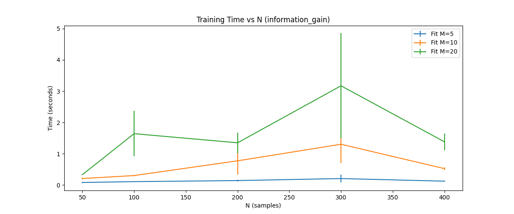
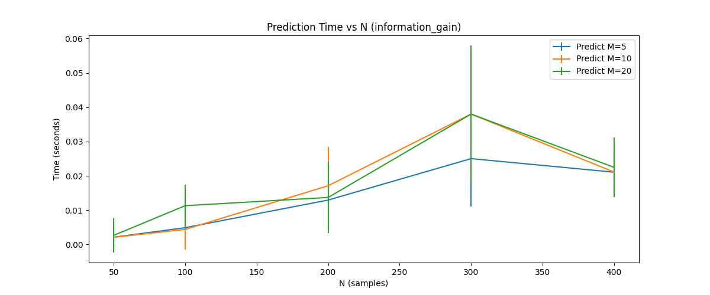
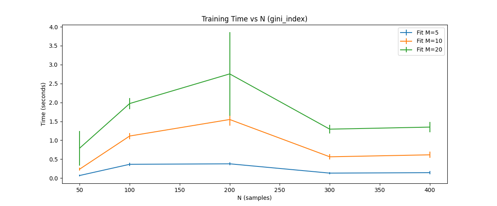
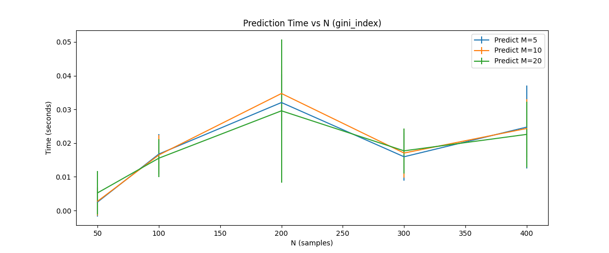

# Runtime Complexity of Decision Trees

## 1. Objective
The goal is to **experimentally verify the runtime complexity** of implemented decision tree by:
- Generating fake data with `N` samples and `M` binary features.
- Measuring the time taken for:
  - Learning the tree.
  - Predicting on test data.

## 2. Theoretical Time Complexity

### Training Complexity
- **At each split:** We evaluate `M` features to find the best split.
- **For each feature:** We may sort or scan `N` samples → `O(N log N)` for sorting
- **Tree depth:** In a balanced tree, depth ≈ `log N`.

**Overall training complexity:**
\[
O(M * N \log N)
\]

### Prediction Complexity
- To classify/regress a single sample, we traverse **one root-to-leaf path** of depth `d`.
- For a balanced tree, `d ≈ log N`.  
- For a highly unbalanced tree, `d` can approach `N`.

**Prediction complexity per sample:**

<b>O(d)</b> ≈ <b>O(log N)</b> (balanced), <b>O(N)</b> (worst case)

## 3. Observations from Plots

## Observations

### 1. Training Time vs N (Information Gain)
- Training time **increases with N (number of samples)** and more steeply with **M (number of features)**.  
- For small M (M=5), training is very fast and almost linear.  
- For higher M (M=20), training time fluctuates more, suggesting **higher sensitivity to dataset size** due to the increased number of split evaluations.  
- This matches the theoretical complexity of **O(N·M·log N)** for building a decision tree using information gain.

### 2. Prediction Time vs N (Information Gain)
- Prediction time increases only **slightly** with N, remaining **much lower than training time**.  
- Differences between M=5, M=10, and M=20 are minimal, which agrees with theory: **prediction complexity depends mainly on tree depth O(d)** (≈ log N for balanced trees).

### 3. Training Time vs N (Gini Index)
- Similar trend as information gain: training time grows with both N and M.  
- Gini index appears **slightly faster** than information gain overall, which is expected since Gini avoids computing logarithms.  
- Variability (error bars) also grows with M, reflecting higher computational cost when evaluating more features per split.

---

## Key Takeaways
- **Training complexity matches theory:**  
  For both Information Gain and Gini Index, training roughly follows `O(N·M·log N)`.  

- **Prediction complexity matches theory:**  
  Prediction time is almost negligible and scales closer to `O(log N)`, consistent with tree depth rather than training set size.  

- **Information Gain vs Gini Index:**  
  Gini tends to train slightly faster due to its simpler computation.  

- **Effect of features (M):**  
  Increasing M has a **larger impact** on training time than increasing N because every split evaluation must check all features.  

## 4. Key Takeaways

- **Training complexity:** ~ `O(M N log N)`
- **Prediction complexity:** ~ `O(log N)` per sample if the tree is balanced   
- **Experimental results match theory:** 
  - Training time grows superlinearly with `N` and linearly with `M`.
  - Prediction time is shallow because tree depth is bounded.

---
 

  
  

 

  
  

