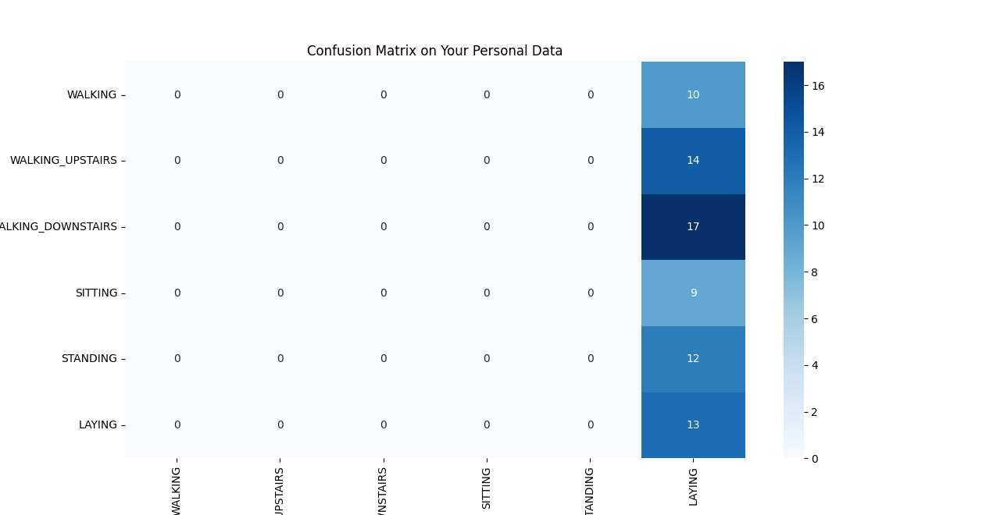

```python

import pandas as pd
import numpy as np
import os
import tsfel
from tqdm import tqdm
from sklearn.tree import DecisionTreeClassifier
from sklearn.metrics import accuracy_score, classification_report, confusion_matrix
import matplotlib.pyplot as plt
import seaborn as sns


#Global settings and constants for the script

#Label mapping
classes ={
    "WALKING": 1, "WALKING_UPSTAIRS": 2, "WALKING_DOWNSTAIRS": 3,
    "SITTING": 4, "STANDING": 5, "LAYING": 6
}


fs = 50 #target frequency
WINDOW_SIZE =128
OVERLAP =0.5


cfg = tsfel.get_features_by_domain('statistical')


uci_train_dir =os.path.join('Combined', 'Train')
personal_data_dir ='personal_data'
output_dir ='processed_data'


def generate_tsfel_features(data_dir, classes_map, tsfel_cfg, sampling_rate):

    all_features_list, labels_list =[], []
    for activity_name in os.listdir(data_dir):
        activity_path =os.path.join(data_dir, activity_name)
        if os.path.isdir(activity_path) and activity_name in classes_map:
            label =classes_map[activity_name]
            for file_name in os.listdir(activity_path):
                sample_df =pd.read_csv(os.path.join(activity_path, file_name))
                features =tsfel.time_series_features_extractor(tsfel_cfg, sample_df, fs=sampling_rate)
                all_features_list.append(features)
                labels_list.append(label)
    
    if not all_features_list:
        return pd.DataFrame(), np.array([])
        
    X_features =pd.concat(all_features_list, ignore_index=True)
    y_labels =np.array(labels_list)
    X_features.columns =['_'.join(col).strip() for col in X_features.columns.values]
    X_features.replace([np.inf, -np.inf], np.nan, inplace=True)
    X_features.fillna(0, inplace=True)
    return X_features, y_labels

def create_windows(data, window_size, overlap):
    windows =[]
    step_size =int(window_size * (1 - overlap))
    for i in range(0, len(data) - window_size + 1, step_size):
        windows.append(data[i:i + window_size])
    return np.array(windows)

print("### Part 1: Loading UCI Training Data & Training Final Model ###")


tsfel_train_path =os.path.join(output_dir, 'X_train_tsfel_custom.csv')
labels_train_path =os.path.join(output_dir, 'y_train.txt')


if os.path.exists(tsfel_train_path) and os.path.exists(labels_train_path):
    print("Loading pre-computed features")
    X_train_uci =pd.read_csv(tsfel_train_path)
    y_train_uci =np.loadtxt(labels_train_path)
else:
    print("Pre-computed features not found. Generating them now")
    X_train_uci, y_train_uci =generate_tsfel_features(uci_train_dir, classes, cfg, fs)
    
    
    os.makedirs(output_dir, exist_ok=True)
    X_train_uci.to_csv(tsfel_train_path, index=False)
    np.savetxt(labels_train_path, y_train_uci, fmt='%d')
    print(f"Features and labels saved to '{output_dir}' for future use.")

if X_train_uci.empty:
    print(f"Error: No training data found or generated.")
else:

    final_model = DecisionTreeClassifier(random_state=42)
    final_model.fit(X_train_uci, y_train_uci)
    print("Final model has been trained and is ready.\n")


    print("### Part 2: Processing and Predicting on Your Personal Data ###")
    all_personal_features =[]
    all_personal_labels =[]

    for file_name in sorted(os.listdir(personal_data_dir)):
        if file_name.endswith('.csv'):
            activity_name =file_name.split('.')[0].replace('my_', '').upper()
            if activity_name in classes:
                true_label =classes[activity_name]
                print(f"Processing your '{activity_name}' activity")

                file_path =os.path.join(personal_data_dir, file_name)
                df_personal_100hz =pd.read_csv(file_path)
                df_personal_100hz =df_personal_100hz[['gFx', 'gFy', 'gFz']]

                df_personal_100hz.columns = ['accx', 'accy', 'accz']

                windows = create_windows(df_personal_100hz.to_numpy(), WINDOW_SIZE, OVERLAP)

                for window in windows:
                    window_df =pd.DataFrame(window, columns=['accx', 'accy', 'accz'])
                    features= tsfel.time_series_features_extractor(cfg, window_df, fs=fs)
                    all_personal_features.append(features)
                    all_personal_labels.append(true_label)

    if all_personal_features:
        X_personal_tsfel =pd.concat(all_personal_features, ignore_index=True)
        y_personal_true =np.array(all_personal_labels)
        X_personal_tsfel.columns =['_'.join(col).strip() for col in X_personal_tsfel.columns.values]
        X_personal_tsfel.replace([np.inf, -np.inf], np.nan, inplace=True)
        X_personal_tsfel.fillna(0, inplace=True)

        y_personal_pred = final_model.predict(X_personal_tsfel)

        print("\n### Performance Report on Your Personal Data ###")
        accuracy = accuracy_score(y_personal_true, y_personal_pred)
        print(f"Overall Accuracy: {accuracy:.4f}\n")

        class_names = [name for name, num in sorted(classes.items(), key=lambda item: item[1])]
        all_labels = sorted(classes.values())

        print("Classification Report:")
        print(classification_report(y_personal_true, y_personal_pred, target_names=class_names, labels=all_labels, zero_division=0))

        print("Confusion Matrix:")
       
        cm = confusion_matrix(y_personal_true, y_personal_pred, labels=all_labels)
        plt.figure(figsize=(10, 8))
        sns.heatmap(cm, annot=True, fmt='d', cmap='Blues',
                    xticklabels=class_names, yticklabels=class_names)
        plt.title('Confusion Matrix on Your Personal Data')
        plt.ylabel('True Label')
        plt.xlabel('Predicted Label')
        plt.show()
    else:
        print(f"\nError: No personal data files were processed from the '{personal_data_dir}' directory.")


```

## Decision of Preprocessing

This decision was based on the following evidence from following facts:
* The model trained on **raw data** performed poorly (~61% accuracy), indicating that this data format is not effective for a Decision Tree.
* The model trained on **author-provided features** performed the best (~86% accuracy), but replicating the complex 561-feature pipeline is impractical and violates the constraint of ensuring the test data is truly "similar".
* The model trained on **TSFEL-generated features** performed very well (~76% accuracy) and, critically, the feature generation process is fully automated and **replicable**.

Therefore, the **TSFEL Featurised Data** model was chosen as it provides the best practical balance between high model performance and the ability to create a consistent data pipeline for new, unseen data.

### Performance Analysis

```
Overall Accuracy: 0.1733

Classification Report:
                    precision    recall  f1-score   support

           WALKING       0.00      0.00      0.00        10
  WALKING_UPSTAIRS       0.00      0.00      0.00        14
WALKING_DOWNSTAIRS       0.00      0.00      0.00        17
           SITTING       0.00      0.00      0.00         9
          STANDING       0.00      0.00      0.00        12
            LAYING       0.17      1.00      0.30        13

          accuracy                           0.17        75
         macro avg       0.03      0.17      0.05        75
      weighted avg       0.03      0.17      0.05        75

```

<p align="center">
  
</p>
<br>

The model performed **poorly** on the personally collected data, achieving an overall accuracy of **17.33%**. The classification report below shows that the model was heavily biased, predicting the `LAYING` activity for nearly all samples.

