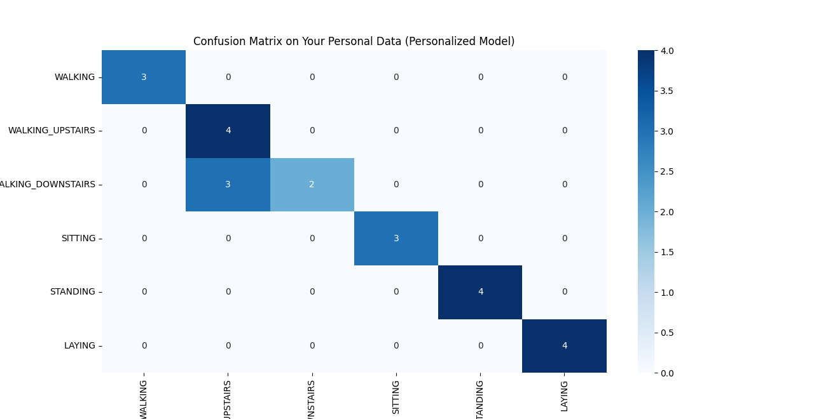

```python
import pandas as pd
import numpy as np
import os
import tsfel
from tqdm import tqdm
from sklearn.model_selection import train_test_split
from sklearn.tree import DecisionTreeClassifier
from sklearn.metrics import accuracy_score, classification_report, confusion_matrix
import matplotlib.pyplot as plt
import seaborn as sns

classes = {
    "WALKING": 1, "WALKING_UPSTAIRS": 2, "WALKING_DOWNSTAIRS": 3,
    "SITTING": 4, "STANDING": 5, "LAYING": 6
}
fs =50 
WINDOW_SIZE =128
OVERLAP =0.5
TEST_SET_SIZE = 0.3  
RANDOM_STATE = 42 
cfg = tsfel.get_features_by_domain('statistical')
personal_data_dir = 'personal_data'


def create_windows(data, window_size, overlap):
    windows =[]
    step_size =int(window_size * (1 - overlap))
    for i in range(0, len(data) - window_size + 1, step_size):
        windows.append(data[i:i + window_size])
    return np.array(windows)


print("### Part 1: Loading all your personal data ###")
all_windows =[]
all_labels =[]

for file_name in sorted(os.listdir(personal_data_dir)):
    if file_name.endswith('.csv'):
        activity_name = file_name.split('.')[0].replace('my_', '').upper()
        if activity_name in classes:
            true_label = classes[activity_name]
            print(f"Loading and windowing '{activity_name}'")
            
            file_path =os.path.join(personal_data_dir, file_name)
            df_personal= pd.read_csv(file_path)

            df_personal= df_personal[['gFx', 'gFy', 'gFz']]
            df_personal.columns= ['accx', 'accy', 'accz']

            windows = create_windows(df_personal.to_numpy(), WINDOW_SIZE, OVERLAP)
            
            if windows.shape[0] > 0:
                all_windows.extend(windows)
                all_labels.extend([true_label] * windows.shape[0])


all_windows =np.array(all_windows)
all_labels =np.array(all_labels)
print(f"\nTotal windows created from all your files: {len(all_windows)}")


print("\n### Splitting your data into training and testing sets ###")
X_train_windows, X_test_windows, y_train, y_test = train_test_split(
    all_windows, 
    all_labels, 
    test_size=TEST_SET_SIZE, 
    random_state=RANDOM_STATE,
    stratify=all_labels
)
print(f"Training windows: {len(X_train_windows)}, Testing windows: {len(X_test_windows)}")

def extract_tsfel_features(windows):
    
    feature_list = []
    for window in tqdm(windows, desc="Extracting TSFEL features"):
        window_df =pd.DataFrame(window, columns=['accx', 'accy', 'accz'])
        features =tsfel.time_series_features_extractor(cfg, window_df, fs=fs)
        feature_list.append(features)
    
    final_features_df= pd.concat(feature_list, ignore_index=True)
    final_features_df.columns = ['_'.join(col).strip() for col in final_features_df.columns.values]
    final_features_df.replace([np.inf, -np.inf], np.nan, inplace=True)
    final_features_df.fillna(0, inplace=True)
    return final_features_df

print("\n### Applying TSFEL to your train and test sets ###")
X_train_tsfel =extract_tsfel_features(X_train_windows)
X_test_tsfel =extract_tsfel_features(X_test_windows)
print("Feature extraction complete.")


print("\n### Training and evaluating the personalized model ###")
personalized_model = DecisionTreeClassifier(random_state=RANDOM_STATE)
personalized_model.fit(X_train_tsfel, y_train)


y_pred = personalized_model.predict(X_test_tsfel)


accuracy = accuracy_score(y_test, y_pred)
print(f"\nOverall Accuracy on your personal test set: {accuracy:.4f}\n")

print("Classification Report:")
class_names = [name for name, num in sorted(classes.items(), key=lambda item: item[1])]
all_class_labels= sorted(classes.values())
print(classification_report(y_test, y_pred, target_names=class_names, labels=all_class_labels, zero_division=0))

print("Confusion Matrix:")
cm = confusion_matrix(y_test, y_pred, labels=all_class_labels)
plt.figure(figsize=(10, 8))
sns.heatmap(cm, annot=True, fmt='d', cmap='Blues',
            xticklabels=class_names, yticklabels=class_names)
plt.title('Confusion Matrix on Your Personal Data (Personalized Model)')
plt.ylabel('True Label')
plt.xlabel('Predicted Label')
plt.show()

```
### Performance Analysis
```
Overall Accuracy on your personal test set: 0.8696

Classification Report:
                    precision    recall  f1-score   support

           WALKING       1.00      1.00      1.00         3
  WALKING_UPSTAIRS       0.57      1.00      0.73         4
WALKING_DOWNSTAIRS       1.00      0.40      0.57         5
           SITTING       1.00      1.00      1.00         3
          STANDING       1.00      1.00      1.00         4
            LAYING       1.00      1.00      1.00         4

          accuracy                           0.87        23
         macro avg       0.93      0.90      0.88        23
      weighted avg       0.93      0.87      0.86        23
```

<br>
<p align="center">
  
</p>
<br>

The model performed **same** as the features provided by authors, achieving an overall accuracy of **86.96%**. The reason for the same is that the subject and the sensors which recorded the data are same as opposite to the last question, where subjects and sensors both were different.
