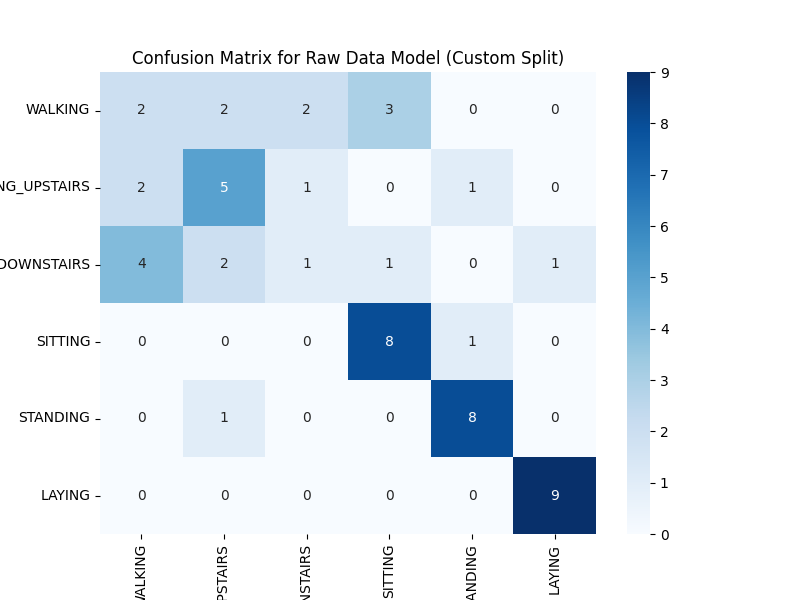
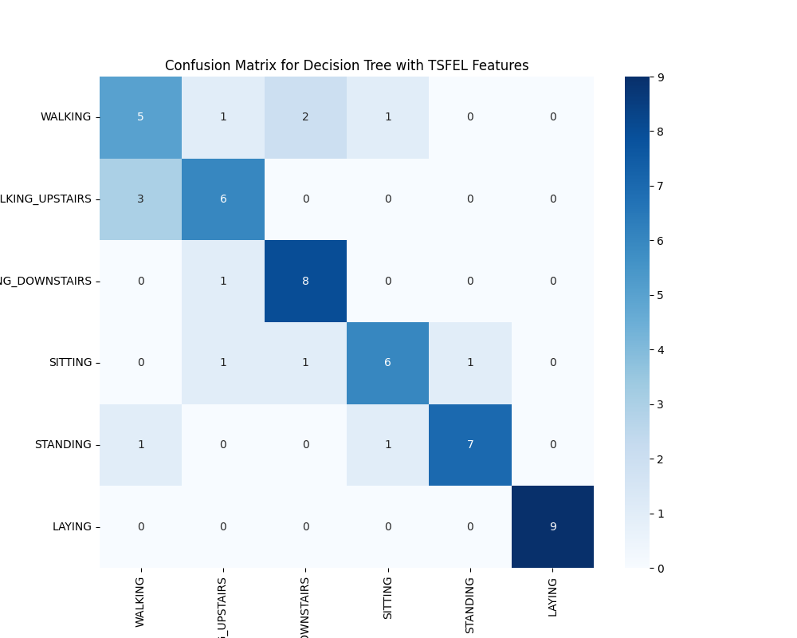
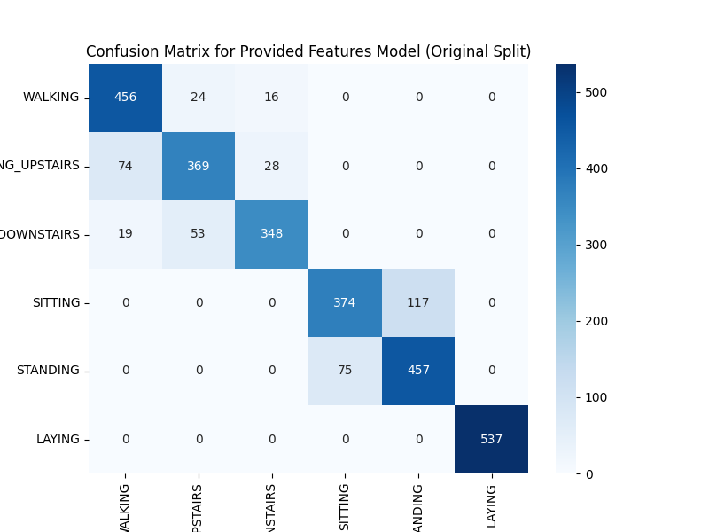
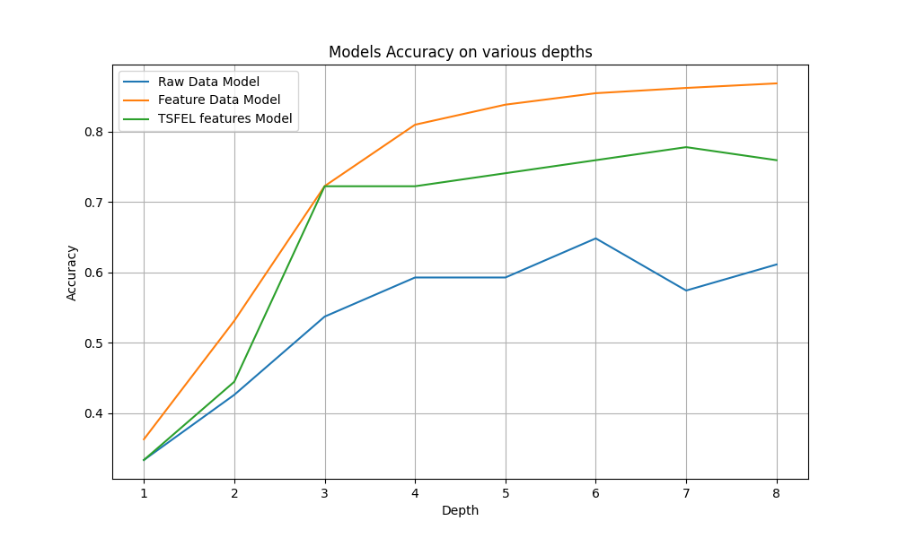

```python
import os

import pandas as pd

import numpy as np

from sklearn.tree import DecisionTreeClassifier

from sklearn.metrics import accuracy_score, confusion_matrix, classification_report, precision_recall_fscore_support

import matplotlib.pyplot as plt

import seaborn as sns

import tsfel

from tqdm import tqdm

import MakeDataset as md

np.random.seed(42)

time =10

offset =100

raw_model_accuracy_list =[]

feature_model_accuracy_list =[]

TSFEL_accuracy_list =[]

folders =["LAYING","SITTING","STANDING","WALKING","WALKING_DOWNSTAIRS","WALKING_UPSTAIRS"]

classes ={"WALKING":1,"WALKING_UPSTAIRS":2,"WALKING_DOWNSTAIRS":3,"SITTING":4,"STANDING":5,"LAYING":6}

activity_labels_map = {v: k for k, v in classes.items()}

activity_labels = [activity_labels_map[i] for i in sorted(activity_labels_map)]


################ Q1 -Subtask 1#####################################

def evaluate_model(X_train, y_train, X_test, y_test, model_name="Model",depth = 6, task2_sub_question2 = False):
    
    print(f"\n--- Evaluating {model_name} ---")
    if task2_sub_question2:
        dt_classifier = DecisionTreeClassifier(max_depth = depth, random_state=42)
    else:
        dt_classifier  DecisionTreeClassifier(random_state=42)
    dt_classifier.fit(X_train, y_train)
    y_pred =dt_classifier.predict(X_test)
    accuracy= accuracy_score(y_test, y_pred)
    precision, recall, _, _ = precision_recall_fscore_support(y_test, y_pred, average='macro')
    if not task2_sub_question2:
        print(f"Accuracy: {accuracy:.4f}")
        print(f"Precision (Macro): {precision:.4f}")
        print(f"Recall (Macro): {recall:.4f}\n")
        print("Classification Report:")
        print(classification_report(y_test, y_pred, target_names=activity_labels))
        cm = confusion_matrix(y_test, y_pred)
        plt.figure(figsize=(8, 6))
        sns.heatmap(cm, annot=True, fmt='d', cmap='Blues', xticklabels=activity_labels, yticklabels=activity_labels)
        plt.title(f'Confusion Matrix for {model_name}')
        plt.ylabel('True Label')
        plt.xlabel('Predicted Label')
        plt.show()

    return {'Model': model_name, 'Accuracy': accuracy, 'Precision': precision, 'Recall': recall}

# The shape is (num_samples, 500, 3). We need to flatten it.

n_samples_train =md.X_train.shape[0]

n_samples_test =md.X_test.shape[0]

X_train_raw_flat =md.X_train.reshape(n_samples_train, -1)

X_test_raw_flat =md.X_test.reshape(n_samples_test, -1)

print(f"Flattened X_train shape: {X_train_raw_flat.shape}")

print(f"Flattened X_test shape: {X_test_raw_flat.shape}")

# Evaluate the model

results_raw =evaluate_model(X_train_raw_flat, md.y_train, X_test_raw_flat, md.y_test, "Raw Data Model (Custom Split)")

for depth in range(1, 9):
    
    result= evaluate_model(X_train_raw_flat, md.y_train, X_test_raw_flat, md.y_test,
                            "Raw Data Model (Custom Split)", depth, True)

    raw_model_accuracy_list.append(result['Accuracy'])
```

##################### output for Q1-subtask 1########################
```
--- Evaluating Raw Data Model (Custom Split) ---
Accuracy: 0.6111
Precision (Macro): 0.5611
Recall (Macro): 0.6111


Classification Report : 
                    precision    recall  f1-score   support

           WALKING       0.25      0.22      0.24         9

  WALKING_UPSTAIRS       0.50      0.56      0.53         9

WALKING_DOWNSTAIRS       0.25      0.11      0.15         9

           SITTING       0.67      0.89      0.76         9

          STANDING       0.80      0.89      0.84         9

            LAYING       0.90      1.00      0.95         9

          accuracy                           0.61        54

         macro avg       0.56      0.61      0.58        54

      weighted avg       0.56      0.61      0.58        54
```

<br>

<p align="center">
  
</p>

########################Q1-Subtask 2################################3
```python

# TSFEL configuration

cfg =tsfel.get_features_by_domain('statistical')

fs=50 

output_dir ='processed_data'

tsfel_train_path= os.path.join(output_dir, 'X_train_tsfel_custom.csv')

tsfel_test_path= os.path.join(output_dir, 'X_test_tsfel_custom.csv')

def generate_tsfel_features(data_dir, classes_map, tsfel_cfg, sampling_rate):
    
    all_features_list =[]
    labels_list =[]
    activity_folders= os.listdir(data_dir)
    for activity_name in tqdm(activity_folders, desc=f"Processing {os.path.basename(data_dir)}"):
        activity_path= os.path.join(data_dir, activity_name)
        if os.path.isdir(activity_path) and activity_name in classes_map:
            label =classes_map[activity_name]
            for file_name in os.listdir(activity_path):
                file_path =os.path.join(activity_path, file_name)
                sample_df =pd.read_csv(file_path)
                features =tsfel.time_series_features_extractor(tsfel_cfg, sample_df, fs=sampling_rate)
                all_features_list.append(features)
                labels_list.append(label)
    X_features =pd.concat(all_features_list, ignore_index=True)
    y_labels =np.array(labels_list)
    X_features.columns = ['_'.join(col).strip() for col in X_features.columns.values]
    X_features.replace([np.inf, -np.inf], np.nan, inplace=True)
    X_features.fillna(0, inplace=True)
    return X_features, y_labels

if not os.path.exists(tsfel_test_path):
    
    print("Test features not found. Generating them now...")
    test_data_dir =os.path.join('Combined', 'Test')
    X_test_tsfel, y_test =generate_tsfel_features(test_data_dir, classes, cfg, fs)
    os.makedirs(output_dir, exist_ok=True)
    X_test_tsfel.to_csv(tsfel_test_path, index=False)
    
    np.savetxt(os.path.join(output_dir, 'y_test.txt'), y_test, fmt='%d')
    print(f"Test features saved to {tsfel_test_path}")
else:

    print("Found pre-computed test features.")


def extract_tsfel_features_custom(data_3d, description=""):

    all_features = []
    for i in tqdm(range(len(data_3d)), desc=f"Extracting TSFEL features for {description}"):
       
        sample_df =pd.DataFrame(data_3d[i], columns=['accx', 'accy', 'accz'])
        
        features =tsfel.time_series_features_extractor(cfg, sample_df, fs=50)
        features.columns = ['_'.join(col).strip() for col in features.columns.values]
        all_features.append(features)
    return pd.concat(all_features, ignore_index=True)

train_data_dir =os.path.join('Combined', 'Train')

all_features_list =[]

labels_list =[]


activity_folders = os.listdir(train_data_dir)

for activity_name in tqdm(activity_folders, desc="Processing Activities"):
    
    activity_path =os.path.join(train_data_dir, activity_name)
    
    if os.path.isdir(activity_path) and activity_name in classes:
       
        label =classes[activity_name]
       
        for file_name in os.listdir(activity_path):
            file_path = os.path.join(activity_path, file_name)
  
            sample_df = pd.read_csv(file_path)
           
            features = tsfel.time_series_features_extractor(cfg, sample_df, fs=50)
           
            all_features_list.append(features)
         
            labels_list.append(label)

print("\nCombining all extracted features")


X_train = pd.concat(all_features_list, ignore_index=True)


y_train = np.array(labels_list)

# Clean up the column names that TSFEL creates (e.g., from ('0_Mean', 'accx') to '0_Mean_accx')
X_train.columns = ['_'.join(col).strip() for col in X_train.columns.values]

# Handle any potential NaN/infinite values that TSFEL might produce
X_train.replace([np.inf, -np.inf], np.nan, inplace=True)

X_train.fillna(0, inplace=True)


print("\nProcessing complete")

print(f"Shape of the final feature matrix X_train: {X_train.shape}")

print(f"Shape of the final labels vector y_train: {y_train.shape}")


os.makedirs('processed_data', exist_ok=True)

output_path = 'processed_data/X_train_tsfel_custom.csv'


X_train.to_csv(output_path, index=False)

print(f"Training features saved to {output_path}")

np.savetxt(os.path.join(output_dir, 'y_train.txt'), y_train, fmt='%d')

print("\nLoading pre-computed TSFEL features and labels...")

y_test = np.loadtxt(os.path.join(output_dir, 'y_test.txt'))

labels_test_path =os.path.join(output_dir, 'y_test.txt')

labels_train_path =os.path.join(output_dir, 'y_train.txt')


X_train =pd.read_csv(tsfel_train_path)


y_train =np.loadtxt(labels_train_path)

X_test = pd.read_csv(tsfel_test_path)

y_test =np.loadtxt(labels_test_path)

print(f"Training features shape: {X_train.shape}")

print(f"Testing features shape: {X_test.shape}")


print("\nTraining the Decision Tree model")


dt_classifier = DecisionTreeClassifier(random_state=42)

dt_classifier.fit(X_train, y_train)

print("Model training complete.")


print("\nEvaluating the model on the test set")


y_pred = dt_classifier.predict(X_test)

accuracy = accuracy_score(y_test, y_pred)

precision, recall, _, _ =precision_recall_fscore_support(y_test, y_pred, average='macro')

print(f"Accuracy: {accuracy:.4f}\n")

print(f"Precision (Macro): {precision:.4f}")

print(f"Recall (Macro): {recall:.4f}\n")

for depth in range(1,9):

    dt_classifier = DecisionTreeClassifier(max_depth = depth, random_state=42)
    dt_classifier.fit(X_train, y_train)
    y_pred = dt_classifier.predict(X_test)
    accuracy = accuracy_score(y_test, y_pred)
    TSFEL_accuracy_list.append(accuracy)


print("Classification Report:")


class_names = [name for name, num in sorted(classes.items(), key=lambda item: item[1])]

print(classification_report(y_test, y_pred, target_names=class_names))


print("Confusion Matrix:")

cm = confusion_matrix(y_test, y_pred)


plt.figure(figsize=(10, 8))

sns.heatmap(cm, annot=True, fmt='d', cmap='Blues',
            xticklabels=class_names, yticklabels=class_names)

plt.title('Confusion Matrix for Decision Tree with TSFEL Features')

plt.ylabel('True Label')

plt.xlabel('Predicted Label')

plt.show()
```

##################### output for Q1-subtask 2########################

```

Evaluating the model on the test set...
Accuracy: 0.7593
Precision (Macro): 0.7624
Recall (Macro): 0.7593

Classification Report:
                    precision    recall  f1-score   support

           WALKING       0.56      0.56      0.56         9

  WALKING_UPSTAIRS       0.67      0.67      0.67         9

WALKING_DOWNSTAIRS       0.73      0.89      0.80         9

           SITTING       0.75      0.67      0.71         9

          STANDING       0.88      0.78      0.82         9

            LAYING       1.00      1.00      1.00         9

          accuracy                           0.76        54

         macro avg       0.76      0.76      0.76        54

      weighted avg       0.76      0.76      0.76        54

```

<br>

<p align="center">
  
</p>


###############Q1-Subtask 3##################
```python

DATASET_PATH = "UCI HAR Dataset/"

X_train_provided =pd.read_csv(os.path.join(DATASET_PATH, 'train', 'X_train.txt'), delim_whitespace=True, header=None)

X_test_provided =pd.read_csv(os.path.join(DATASET_PATH, 'test', 'X_test.txt'), delim_whitespace=True, header=None)

# Load the original labels
y_train_provided = pd.read_csv(os.path.join(DATASET_PATH, 'train', 'y_train.txt'), header=None).squeeze()

y_test_provided =pd.read_csv(os.path.join(DATASET_PATH, 'test', 'y_test.txt'), header=None).squeeze()

print(f"\nOriginal Provided X_train shape: {X_train_provided.shape}")

print(f"Original Provided X_test shape: {X_test_provided.shape}")

results_provided =evaluate_model(X_train_provided, y_train_provided, X_test_provided, y_test_provided, "Provided Features Model (Original Split)")

for depth in range(1,9):
    
    result = evaluate_model(X_train_provided, y_train_provided, X_test_provided, y_test_provided,
                            "Provided Features Model (Original Split)", depth, True)
    feature_model_accuracy_list.append(result['Accuracy'])

```

##################### output for Q1-subtask 3########################

```

--- Evaluating Provided Features Model (Original Split) ---
Accuracy: 0.8622
Precision (Macro): 0.8625
Recall (Macro): 0.8587

Classification Report:
                    precision    recall  f1-score   support

           WALKING       0.83      0.92      0.87       496

  WALKING_UPSTAIRS       0.83      0.78      0.80       471

WALKING_DOWNSTAIRS       0.89      0.83      0.86       420

           SITTING       0.83      0.76      0.80       491

          STANDING       0.80      0.86      0.83       532

            LAYING       1.00      1.00      1.00       537

          accuracy                           0.86      2947

         macro avg       0.86      0.86      0.86      2947

      weighted avg       0.86      0.86      0.86      2947

```

<br>

<p align="center">
  
</p>


###############Q1-Subtask 4##################

Out of all the three models, the model with features provided in the data set is better, becuase 
this model has higher scores in the important metrics like accuracy, precision and recall, which 
means, model has correctly classified more instances compared to the other three models.


###############  Question-2  ##################
```python

def test_dt_with_various_depths():

    depth_list = range(1, 9, 1)
    plt.figure(figsize=(10, 6))
    plt.plot(depth_list, raw_model_accuracy_list, label='Raw Data Model')
    plt.plot(depth_list, feature_model_accuracy_list, label='Feature Data Model')
    plt.plot(depth_list, TSFEL_accuracy_list, label='TSFEL features Model')
    plt.xlabel('Depth')
    plt.ylabel('Accuracy')
    plt.title('Models Accuracy on various depths')
    plt.legend()
    plt.grid(True)
    plt.show()

test_dt_with_various_depths()

```

##################### output for Question-2########################

<br>

<p align="center">
  
</p>

##################### output for Question-3########################

Yes, there are activities, where the performance is bad, especially in the Raw data model, and
TSFEL model, performed a little better compared to Raw model, but NOT significantly better.

- **The reasons are :**
- **Raw Data model:** since the model is trained on raw data, it may not contain the most 
informative features for distinguishing these activities. The Raw data can be noisy and
difficult for the model to interpret directly.Walking, walking upstairs, and 
walking downstairs have similar patterns in raw data, making them difficult to differentiate
- **TSFEL Data model:** While TSFEL features are an improvement, they might not perfectly 
capture the small differences among activities that have similar sensor patterns. The data 
insufficiency might also be the reason for not good performance
- **Features Data set model:** This model has been trained and tested on more comprehensive dataset
leading to better generalisation and performance metrics. The features are well-structured and 
effective for distinguishing between various activities. This model makes the classification easier
for decision tree.


