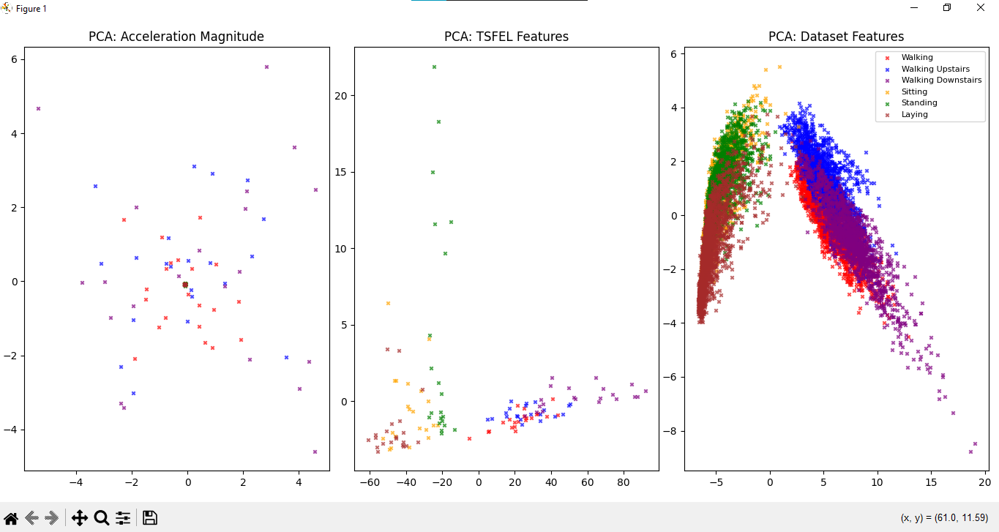

# Assignment - HAR Task 1: Exploratory Data Analysis (EDA)

---

## Q1. Waveform Plot for Each Activity

### Code
```python
import numpy as np
import matplotlib.pyplot as plt

# training data
X = np.load("training_data.npy")
y = np.load("training_labels.npy")

# ACTIVITIES
ACTIVITIES = {
    1: "Walking",
    2: "Walking Upstairs",
    3: "Walking Downstairs",
    4: "Sitting",
    5: "Standing",
    6: "Laying"
}

# Pick one sample from each activity
samples = {}
for label in np.unique(y):
    # first index in y where y == label
    idx = np.where(y == label)[0][0]
    samples[label] = X[idx]  # whole sample of shape (500,3)

# Plot signals
for i, label in enumerate(samples.keys()):
    plt.subplot(3, 2, i+1)
    plt.plot(samples[label][:,0], color="r", label="accx")
    plt.plot(samples[label][:,1], color="g", label="accy")
    plt.plot(samples[label][:,2], color="b", label="accz")
    plt.title(ACTIVITIES[label])
    plt.xlabel("Time (samples)")
    plt.ylabel("Acceleration (g)")
    plt.legend(fontsize=6)

plt.tight_layout()
plt.show()
plt.savefig("Plots/waveform.png")  # save instead of show
plt.close()
```
<p>

</p>

**Observations:**
- *Walking, Walking Upstairs, Walking Downstairs* shows the periodic fluctuations in acceleration.
- *Sitting, *Laying* and Standing* have mostly flat line.
- Thus, **dynamic activities** (walking types) can be clearly classified from **static activities** (sitting/standing/laying).

**Conclusion:**  
The data shows clear differences between activities. A classification model should be able to separate dynamic vs static activities effectively. Differentiating between the three walking types may be more challenging due to their similarities.

---

## Q2. Static vs Dynamic Activities using Linear Acceleration Magnitude

### Code
```python
import numpy as np
import matplotlib.pyplot as plt

# training data
X = np.load("training_data.npy")
y = np.load("training_labels.npy")

# ACTIVITIES
ACTIVITIES = {
    1: "Walking",
    2: "Walking Upstairs",
    3: "Walking Downstairs",
    4: "Sitting",
    5: "Standing",
    6: "Laying"
}

# Pick one sample from each activity
samples = {}
for label in np.unique(y):
    # first index in y where y == label
    idx = np.where(y == label)[0][0]
    samples[label] = X[idx]  # whole sample of shape (500,3)

# Plot signals
for i, label in enumerate(samples.keys()):
    plt.subplot(3, 2, i+1)
    magnitude = np.sqrt(np.sum(samples[label]**2, axis=1))  # linear acceleration magnitude
    plt.plot(magnitude, color="r")

    plt.title(ACTIVITIES[label])
    plt.xlabel("Time (samples)")
    plt.ylabel("Acceleration (g)")

    plt.ylim(0, 2)
    plt.yticks(np.arange(0, 3, 1))

plt.tight_layout()
plt.savefig("Plots/linear_acceleration.png")
plt.close()
```

<p>

</p>

**Observations:**

A simple threshold on the linear acceleration magnitude is enough to separate static from dynamic activities.

**Conclusion:**  
In *Dynamic activities* it is showing oscillation but in *Static Activities* it is just showing values near to **1g** value. So we do not really need a ML model to differentiate between *Static activities* (laying, sitting, standing) and *Dynamic activities*(walking, walking_downstairs, walking_upstairs). 


---


## Q3. Visualizing Data using PCA

### Code
```python
import numpy as np
import pandas as pd
import matplotlib.pyplot as plt
from sklearn.decomposition import PCA
import tsfel   

# Activity labels
ACTIVITIES = {
    1: "Walking",
    2: "Walking Upstairs",
    3: "Walking Downstairs",
    4: "Sitting",
    5: "Standing",
    6: "Laying"
}

# colors
colors = {
    1: 'red', 
    2: 'blue', 
    3: 'purple', 
    4: 'orange', 
    5: 'green', 
    6: 'brown'
}

X = np.load("training_data.npy")   # shape (N, 500, 3)
y = np.load("training_labels.npy") # shape (N,)

# PCA Total Acceleration
acc_magnitude = np.sqrt(np.sum(X**2, axis=2))   # (N, 500)
acc_pca = PCA(n_components=2)
X_acc_pca = acc_pca.fit_transform(acc_magnitude)

# PCA TSFEL Features 
cfg = tsfel.get_features_by_domain("statistical")
feature_list = []
for i in range(X.shape[0]):
    df_feat = tsfel.time_series_features_extractor(cfg, 
                                                   acc_magnitude[i].reshape(-1,1),
                                                   fs=50, 
                                                   verbose=0)
    feature_list.append(df_feat.values[0])
tsfel_features = np.array(feature_list)

tsfel_pca = PCA(n_components=2)
X_tsfel_pca = tsfel_pca.fit_transform(tsfel_features)

# PCA Dataset Features
features_train = np.loadtxt("UCI HAR Dataset/train/X_train.txt")
labels_train   = np.loadtxt("UCI HAR Dataset/train/y_train.txt").astype(int)
features_test  = np.loadtxt("UCI HAR Dataset/test/X_test.txt")
labels_test    = np.loadtxt("UCI HAR Dataset/test/y_test.txt").astype(int)

X_full = np.vstack((features_train, features_test))
y_full = np.concatenate((labels_train, labels_test))

dataset_pca = PCA(n_components=2)
X_dataset_pca = dataset_pca.fit_transform(X_full)

# Matplotlib Plotting 
fig, axes = plt.subplots(1, 3, figsize=(18, 6))

for label in np.unique(y):
    axes[0].scatter(X_acc_pca[y==label, 0], X_acc_pca[y==label, 1],
                    c=colors[label], s=10, label=ACTIVITIES[label], alpha=0.7, marker="x")
axes[0].set_title("PCA: Acceleration Magnitude")

for label in np.unique(y):
    axes[1].scatter(X_tsfel_pca[y==label, 0], X_tsfel_pca[y==label, 1],
                    c=colors[label], s=10, label=ACTIVITIES[label], alpha=0.7, marker="x")
axes[1].set_title("PCA: TSFEL Features")

for label in np.unique(y_full):
    axes[2].scatter(X_dataset_pca[y_full==label, 0], X_dataset_pca[y_full==label, 1],
                    c=colors[label], s=10, label=ACTIVITIES[label], alpha=0.7, marker="x")
axes[2].set_title("PCA: Dataset Features")
axes[2].legend(loc="best", fontsize=8)

plt.tight_layout()
plt.savefig("plots/pca_comparison.png")
plt.close()
```
<p>

</p>

**Observations:**
- Total Acceleration: Very poor separability --> not enough information.

- TSFEL Features (statistical): Moderate separability --> captures more signal characteristics, but still limited.

- Dataset Features: Best separability --> clear grouping of activities, both static and dynamic.

**Conclusion:**

The dataset features + PCA method is the best for visualizing activity classes

---


## Q4. Correlation Analysis of Features

### Code
```python
import numpy as np
import matplotlib.pyplot as plt
import tsfel
import pandas as pd

X = np.load("training_data.npy")  # shape (N, 500, 3)

acc_magnitude = np.sqrt(np.sum(X**2, axis=2))  # shape (N, 500)

# TSFEL Features
cfg = tsfel.get_features_by_domain("statistical")  # choose statistical features
tsfel_list = []
for i in range(acc_magnitude.shape[0]):
    df_feat = tsfel.time_series_features_extractor(cfg,
                                                   acc_magnitude[i].reshape(-1, 1),
                                                   fs=50,
                                                   verbose=0)
    tsfel_list.append(df_feat.values[0])
tsfel_features = np.array(tsfel_list)

# Save TSFEL feature names
tsfel_feature_names = list(df_feat.columns)

# Correlation matrix for TSFEL
tsfel_corr = np.corrcoef(tsfel_features, rowvar=False)

plt.figure(figsize=(8, 6))
plt.matshow(tsfel_corr, cmap="bwr", fignum=1, vmin=-1, vmax=1)
plt.colorbar(label="Correlation strength")
plt.title("Correlation map - TSFEL features", pad=20)
plt.show()

# Identify highly correlated TSFEL pairs
cutoff_val = 0.85
tsfel_idx = np.argwhere(np.abs(tsfel_corr) > cutoff_val)
tsfel_pairs = [(tsfel_feature_names[i], tsfel_feature_names[j], tsfel_corr[i, j]) 
               for i, j in tsfel_idx if i < j]

print("TSFEL features with correlation above 0.85:")
print(tsfel_pairs if tsfel_pairs else "None found")

# Dataset Features 
X_train = np.loadtxt("UCI HAR Dataset/train/X_train.txt")
X_test  = np.loadtxt("UCI HAR Dataset/test/X_test.txt")
X_full  = np.vstack((X_train, X_test))

# Load dataset feature names
with open("UCI HAR Dataset/features.txt") as f:
    dataset_feature_names = [line.strip().split()[1] for line in f]

# Correlation matrix for dataset features
dataset_corr = np.corrcoef(X_full, rowvar=False)

plt.matshow(dataset_corr, cmap="bwr", fignum=2, vmin=-1, vmax=1)
plt.colorbar(label="Correlation strength")
plt.title("Correlation map - Dataset features", pad=20)
plt.show()

# Identify highly correlated dataset pairs
dataset_idx = np.argwhere(np.abs(dataset_corr) > cutoff_val)
dataset_pairs = [(dataset_feature_names[i], dataset_feature_names[j], dataset_corr[i, j]) 
                 for i, j in dataset_idx if i < j]

print("Dataset features with correlation above 0.85:")
print(dataset_pairs if dataset_pairs else "None found")

# Observation 
if tsfel_pairs or dataset_pairs:
    print("\nObservation: Strongly correlated features found — possible redundancy.")
else:
    print("\nObservation: No redundant features found (no strong correlations).")

```

</br>


**Observation:**

- *TSEFL*
0_mean and 0_Standard deviation with correlation index -0.9741
0_Standard deviation and 0_Variance with correlation index 0.9577

- *Dataset* 
fBodyBodyGyroJerkMag-skewness() and fBodyBodyGyroJerkMag-kurtosis() with correlation index 0.9676
fBodyBodyGyroJerkMag-energy() and fBodyBodyGyroJerkMag-iqr() with correlation index 0.8666

**Conclusion:**

I have written just couple of features which are highly correlated, (My cutoff for highly correlated is more than 0.85). There are many such correlated features. So yes, There are redundant features

---
---
